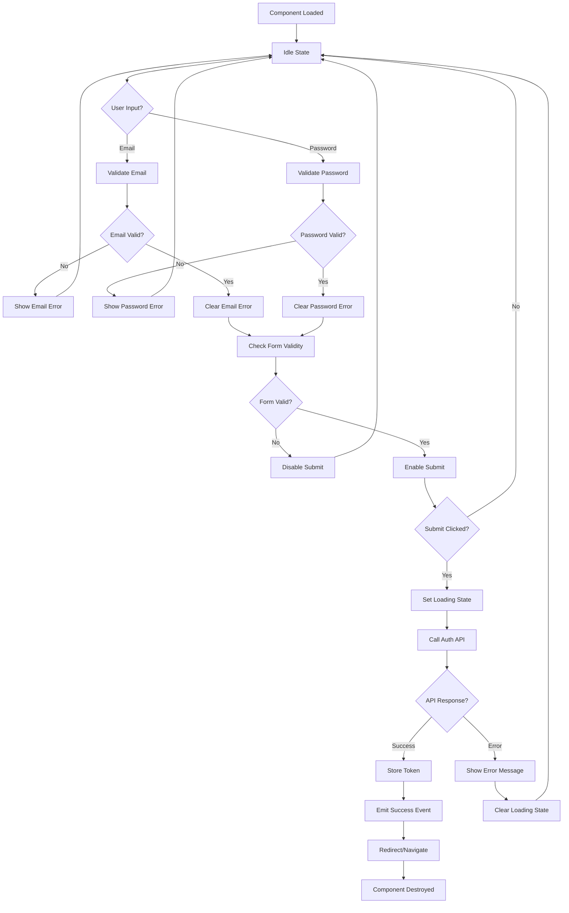
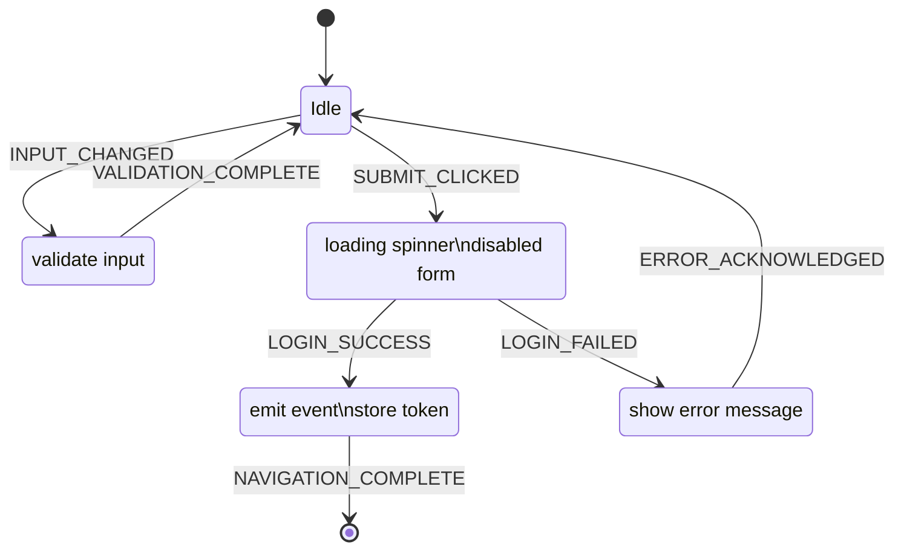

# LOGIN COMPONENT - Analisi Completa e Design

## 🎯 EXECUTIVE SUMMARY

**Obiettivo**: Sviluppare un componente di login in Lit Element riutilizzabile per il progetto ORDER MANAGER, seguendo metodologie XP/TDD/BDD/DDD e standard enterprise.

**Timeline**: Sprint 1-2 settimane (MVP + refinement)  
**Team**: PM/PO/Tech Lead + 2 Junior Developers (Pair Programming)

---

## 📊 ANALISI DEL DOMINIO

### Bounded Context: Authentication
```
Authentication Context
├── Login (Use Case)
├── Logout (Use Case)  
├── Token Refresh (Use Case)
├── Password Reset (Use Case)
└── Session Management (Use Case)
```

### Entities & Value Objects
```typescript
// Value Objects
Email: string (validation: RFC 5322)
Password: string (min 8 chars, complexity rules)
Token: string (JWT format)

// Domain Events
UserLoginAttempted
UserLoginSucceeded  
UserLoginFailed
TokenExpired
```

---

## 🏗️ ARCHITETTURA TECNICA

### Component Architecture (Clean Architecture)
```
┌─────────────────────────────────────┐
│           Presentation              │
│  ┌─────────────────────────────────┐│
│  │     LoginComponent (Lit)        ││
│  │  - Template rendering           ││
│  │  - Event handling               ││
│  │  - State management             ││
│  └─────────────────────────────────┘│
└─────────────────────────────────────┘
┌─────────────────────────────────────┐
│           Application               │
│  ┌─────────────────────────────────┐│
│  │     AuthService                 ││
│  │  - Login use case               ││ 
│  │  - Token management             ││
│  │  - Validation logic             ││
│  └─────────────────────────────────┘│
└─────────────────────────────────────┘
┌─────────────────────────────────────┐
│          Infrastructure             │
│  ┌─────────────────────────────────┐│
│  │     HttpClient                  ││
│  │  - API communication           ││
│  │  - Error handling               ││
│  │  - Retry logic                  ││
│  └─────────────────────────────────┘│
└─────────────────────────────────────┘
```

### State Management Pattern
```typescript
interface LoginState {
  isLoading: boolean;
  email: string;
  password: string;
  errors: ValidationErrors;
  loginError: string | null;
  isAuthenticated: boolean;
}

// State Machine States
type LoginStateType = 
  | 'idle' 
  | 'validating' 
  | 'submitting' 
  | 'success' 
  | 'error';
```

---

## 🎨 DESIGN SYSTEM

### Component Hierarchy
```
login-component
├── login-form
│   ├── email-input (reusable)
│   ├── password-input (reusable)
│   ├── submit-button (reusable)
│   └── error-message (reusable)
├── loading-spinner (reusable)
└── success-notification (reusable)
```

### Wireframe ASCII
```
┌─────────────────────────────────────┐
│            LOGIN                    │
├─────────────────────────────────────┤
│ Email: [________________]           │
│        [error message]              │
│                                     │
│ Password: [________________] [👁]    │
│           [error message]           │
│                                     │
│ [ ] Remember me                     │
│                                     │
│        [  LOGIN  ] [CANCEL]         │
│                                     │
│ Forgot password? | Register         │
└─────────────────────────────────────┘
```

---

## 📝 ACCEPTANCE CRITERIA (BDD)

### Feature: User Login
```gherkin
Feature: User Login
  As a user of the ORDER MANAGER system
  I want to login with my credentials
  So that I can access the application features

  Background:
    Given the login component is rendered
    And the backend API is available at "/api/auth/login"

  Scenario: Successful login with valid credentials
    Given I have valid user credentials
    When I enter email "user@example.com"
    And I enter password "SecurePass123!"
    And I click the "Login" button
    Then I should see a loading indicator
    And the API should receive a POST request to "/api/auth/login"
    And I should receive a JWT token
    And I should be redirected to the dashboard
    And a "user-logged-in" event should be dispatched

  Scenario: Failed login with invalid credentials
    Given I have invalid user credentials
    When I enter email "user@example.com"  
    And I enter password "wrongpassword"
    And I click the "Login" button
    Then I should see an error message "Invalid credentials"
    And the password field should be cleared
    And the form should remain visible

  Scenario: Email validation
    When I enter email "invalid-email"
    And I move focus away from email field
    Then I should see error "Please enter a valid email address"
    And the login button should be disabled

  Scenario: Password validation
    When I enter password "123"
    And I move focus away from password field  
    Then I should see error "Password must be at least 8 characters"
    And the login button should be disabled

  Scenario: Network error handling
    Given the backend API is unavailable
    When I submit valid credentials
    Then I should see error "Unable to connect. Please try again."
    And the form should remain editable

  Scenario: Remember me functionality
    Given I check "Remember me"
    When I login successfully
    Then the auth token should be persisted in localStorage
    When I check "Remember me" is unchecked
    And I login successfully
    Then the auth token should be stored in sessionStorage

  Scenario: Accessibility compliance
    When I navigate using only keyboard
    Then all interactive elements should be focusable
    And focus indicators should be visible
    And screen readers should announce field labels and errors

  Scenario: Loading state management
    When I click "Login" with valid credentials
    Then the login button should show "Logging in..."
    And the login button should be disabled
    And all form fields should be disabled
    And a loading spinner should be visible
```

---

## 🔍 LIBRERIE E PATTERN ANALYSIS

### Validation Libraries Comparison

| Library | Pros | Cons | Verdict |
|---------|------|------|---------|
| **Joi** | Schema-based, rich validation | Large bundle, complex setup | ❌ Overkill |
| **Yup** | Good TypeScript support | Still heavy for simple validation | ⚠️ Consider |
| **Zod** | TypeScript-first, tree-shakable | Learning curve | ✅ **RECOMMENDED** |
| **Custom** | Lightweight, specific needs | More maintenance | ✅ **ALTERNATIVE** |

**Decision**: Start with **Custom Validation** per semplicità, migrate to **Zod** se necessario.

### HTTP Client Options

| Option | Pros | Cons | Verdict |
|--------|------|------|---------|
| **Fetch API** | Native, no dependencies | Manual error handling | ✅ **RECOMMENDED** |
| **Axios** | Rich features, interceptors | Bundle size, dependency | ❌ Overkill |
| **Lit HTTP Client** | Framework integration | Limited adoption | ⚠️ Experimental |

**Decision**: **Fetch API** con wrapper custom per error handling.

### State Management Options

| Pattern | Pros | Cons | Verdict |
|---------|------|------|---------|
| **Lit Reactive Properties** | Native, simple | Limited for complex state | ✅ **MVP** |
| **Redux Toolkit** | Predictable, DevTools | Complex setup, boilerplate | ❌ Overkill |
| **Zustand** | Simple, TypeScript | External dependency | ⚠️ Future |
| **Custom State Machine** | Tailored, educational | Development time | ✅ **LEARNING** |

**Decision**: **Lit Reactive Properties** + **Simple State Machine** pattern.

---

## 🏭 IMPLEMENTATION PATTERNS

### 1. Observer Pattern (Events)
```typescript
// Component emits domain events
this.dispatchEvent(new CustomEvent('user-login-attempt', {
  detail: { email, timestamp: Date.now() },
  bubbles: true
}));
```

### 2. Strategy Pattern (Validation)
```typescript
interface ValidationStrategy {
  validate(value: string): ValidationResult;
}

class EmailValidator implements ValidationStrategy {
  validate(email: string): ValidationResult {
    // RFC 5322 regex validation
  }
}
```

### 3. Command Pattern (Actions)
```typescript
interface LoginCommand {
  execute(): Promise<LoginResult>;
}

class LoginUserCommand implements LoginCommand {
  constructor(private email: string, private password: string) {}
  
  async execute(): Promise<LoginResult> {
    // Login logic
  }
}
```

### 4. State Machine Pattern
```typescript
class LoginStateMachine {
  private state: LoginStateType = 'idle';
  
  transition(event: LoginEvent): void {
    switch (this.state) {
      case 'idle':
        if (event.type === 'SUBMIT') this.state = 'validating';
        break;
      case 'validating':
        if (event.type === 'VALID') this.state = 'submitting';
        if (event.type === 'INVALID') this.state = 'error';
        break;
      // ... other transitions
    }
  }
}
```

---

## 📋 PSEUDOCODICE MVP

### Component Structure
```typescript
@customElement('login-component')
class LoginComponent extends LitElement {
  // Reactive Properties (State)
  @state() private loginState: LoginState = {
    isLoading: false,
    email: '',
    password: '',
    rememberMe: false,
    errors: {},
    loginError: null
  };

  // Injected Dependencies  
  private authService: AuthService;
  private validator: LoginValidator;

  // Lifecycle
  constructor() {
    super();
    this.authService = new AuthService();
    this.validator = new LoginValidator();
  }

  // Event Handlers
  private handleEmailInput(e: InputEvent): void {
    const email = (e.target as HTMLInputElement).value;
    this.loginState = { 
      ...this.loginState, 
      email,
      errors: { ...this.loginState.errors, email: null }
    };
    this.validateEmail(email);
  }

  private async handleSubmit(e: Event): Promise<void> {
    e.preventDefault();
    
    if (!this.isFormValid()) return;
    
    this.setLoadingState(true);
    
    try {
      const result = await this.authService.login({
        email: this.loginState.email,
        password: this.loginState.password,
        rememberMe: this.loginState.rememberMe
      });
      
      this.handleLoginSuccess(result);
    } catch (error) {
      this.handleLoginError(error);
    } finally {
      this.setLoadingState(false);
    }
  }

  // Validation Methods
  private validateEmail(email: string): boolean {
    const error = this.validator.validateEmail(email);
    this.setFieldError('email', error);
    return !error;
  }

  private validatePassword(password: string): boolean {
    const error = this.validator.validatePassword(password);
    this.setFieldError('password', error);
    return !error;
  }

  // State Management
  private setLoadingState(isLoading: boolean): void {
    this.loginState = { ...this.loginState, isLoading };
  }

  private setFieldError(field: string, error: string | null): void {
    this.loginState = {
      ...this.loginState,
      errors: { ...this.loginState.errors, [field]: error }
    };
  }

  // Template
  render() {
    return html`
      <form @submit=${this.handleSubmit} class="login-form">
        ${this.renderEmailField()}
        ${this.renderPasswordField()}
        ${this.renderRememberMe()}
        ${this.renderSubmitButton()}
        ${this.renderErrorMessage()}
        ${this.renderLoadingSpinner()}
      </form>
    `;
  }
}
```

---

## 🌊 FLOW CHARTS

### Login Process Flow


### State Machine Diagram


---

## 🎨 COMPONENT API DESIGN

### Public Properties
```typescript
interface LoginComponentProps {
  // Configuration
  apiEndpoint?: string;          // Default: '/api/auth/login'
  redirectUrl?: string;          // Default: '/dashboard'
  rememberMeDefault?: boolean;   // Default: false
  
  // Styling
  theme?: 'light' | 'dark' | 'auto';
  size?: 'small' | 'medium' | 'large';
  
  // Behavior
  autoFocus?: boolean;           // Default: true
  validateOnBlur?: boolean;      // Default: true
  showPasswordToggle?: boolean;  // Default: true
  
  // Customization
  emailLabel?: string;           // Default: 'Email'
  passwordLabel?: string;        // Default: 'Password'
  submitLabel?: string;          // Default: 'Login'
}
```

### Custom Events
```typescript
// Domain Events
interface LoginEvents {
  'login-attempt': { email: string; timestamp: number };
  'login-success': { token: string; user: UserInfo };
  'login-error': { error: LoginError; timestamp: number };
  'validation-error': { field: string; error: string };
  'form-state-change': { isValid: boolean; isLoading: boolean };
}
```

### CSS Custom Properties
```css
:host {
  /* Colors */
  --login-primary-color: #007bff;
  --login-error-color: #dc3545;
  --login-success-color: #28a745;
  --login-border-color: #ced4da;
  
  /* Spacing */
  --login-padding: 1rem;
  --login-border-radius: 0.375rem;
  --login-input-height: 2.5rem;
  
  /* Typography */
  --login-font-family: -apple-system, BlinkMacSystemFont, 'Segoe UI', Roboto;
  --login-font-size: 1rem;
  --login-line-height: 1.5;
  
  /* Debug */
  --login-debug-border: 1px solid red; /* Show borders in debug mode */
}
```

---

## 🧪 TESTING STRATEGY

### Unit Tests (70% Coverage)
```typescript
describe('LoginComponent', () => {
  describe('Email Validation', () => {
    it('should show error for invalid email format', () => {
      // TDD: RED -> GREEN -> REFACTOR
    });
    
    it('should clear error for valid email', () => {
      // Test implementation
    });
  });

  describe('Password Validation', () => {
    it('should enforce minimum length requirement', () => {
      // Test implementation
    });
    
    it('should validate complexity rules', () => {
      // Test implementation  
    });
  });

  describe('Form Submission', () => {
    it('should prevent submission with invalid data', () => {
      // Test implementation
    });
    
    it('should emit login-attempt event on valid submission', () => {
      // Test implementation
    });
  });
});
```

### Integration Tests (20% Coverage)  
```typescript
describe('LoginComponent Integration', () => {
  it('should integrate with AuthService successfully', async () => {
    // Mock AuthService
    // Test complete login flow
  });
  
  it('should handle network errors gracefully', async () => {
    // Mock network failure
    // Test error handling
  });
});
```

### E2E Tests (10% Coverage)
```typescript
describe('Login E2E', () => {
  it('should complete full login workflow', async () => {
    // Puppeteer/Playwright test
    // User interaction simulation
  });
});
```

---

## 🔧 DEVELOPMENT ENVIRONMENT

### File Structure
```
src/
├── components/
│   ├── login-component/
│   │   ├── login-component.ts        # Main component
│   │   ├── login-component.css       # Styles
│   │   ├── login-component.test.ts   # Unit tests
│   │   └── login-component.stories.ts # Storybook
│   ├── shared/
│   │   ├── email-input/
│   │   ├── password-input/
│   │   └── loading-spinner/
├── services/
│   ├── auth.service.ts
│   ├── auth.service.test.ts
│   └── validation.service.ts
├── types/
│   ├── auth.types.ts
│   └── component.types.ts
└── utils/
    ├── validators.ts
    └── test-helpers.ts
```

### Build Configuration
```typescript
// vite.config.ts
export default defineConfig({
  build: {
    lib: {
      entry: 'src/components/login-component/index.ts',
      formats: ['es'],
      fileName: 'login-component'
    },
    rollupOptions: {
      external: ['lit'],
      output: {
        globals: {
          'lit': 'Lit'
        }
      }
    }
  },
  esbuild: {
    target: 'es2020'
  }
});
```

---

## 📚 EDGE CASES & ERROR HANDLING

### Edge Cases to Handle
1. **Network Failures**: Timeout, connection loss, server errors
2. **Invalid Responses**: Malformed JSON, unexpected status codes
3. **Token Expiration**: During login process
4. **Concurrent Logins**: Multiple tabs/windows
5. **Browser Compatibility**: Older browsers, disabled JavaScript
6. **Accessibility**: Screen readers, keyboard navigation
7. **Security**: XSS prevention, CSRF protection
8. **Performance**: Slow networks, large payloads

### Error Handling Strategy
```typescript
enum LoginErrorType {
  VALIDATION_ERROR = 'validation_error',
  NETWORK_ERROR = 'network_error',
  AUTHENTICATION_ERROR = 'authentication_error',
  SERVER_ERROR = 'server_error',
  UNKNOWN_ERROR = 'unknown_error'
}

class LoginError extends Error {
  constructor(
    public type: LoginErrorType,
    message: string,
    public originalError?: Error
  ) {
    super(message);
    this.name = 'LoginError';
  }
}
```

---

## ⚡ PERFORMANCE CONSIDERATIONS

### Bundle Size Optimization
- Tree shaking enabled
- Dynamic imports for non-critical features
- CSS-in-JS minimal usage
- No external heavy dependencies

### Runtime Performance
- Debounced validation (300ms)
- Memoized validation results
- Efficient re-rendering with Lit's reactive properties
- Lazy loading of non-essential features

### Network Optimization
- Request deduplication
- Retry with exponential backoff
- Compression support
- Caching strategy for static assets

---

## 🏁 DEFINITION OF DONE

### MVP Checklist
- [ ] Component renders correctly in isolation
- [ ] Email/password validation working
- [ ] API integration with JWT handling
- [ ] Loading states implemented
- [ ] Error handling complete
- [ ] Accessibility compliance (WCAG 2.1 AA)
- [ ] Unit tests >80% coverage
- [ ] Integration tests passing
- [ ] Documentation complete (JSDoc + README)
- [ ] Storybook stories created
- [ ] Debug mode working
- [ ] Cross-browser testing passed

### Quality Gates
- [ ] TypeScript strict mode compliance
- [ ] ESLint + Prettier validation
- [ ] Performance budget under 10KB gzipped
- [ ] Lighthouse accessibility score >90
- [ ] Visual regression tests passing
- [ ] Security audit clean
- [ ] Bundle analysis reviewed

---

## 🚀 NEXT STEPS

### Sprint 1 (Week 1): MVP Development
1. **Day 1-2**: Setup + TDD structure + Basic validation
2. **Day 3-4**: API integration + State management  
3. **Day 5**: Error handling + Loading states

### Sprint 2 (Week 2): Polish & Integration
1. **Day 1-2**: Accessibility + Testing completion
2. **Day 3-4**: Storybook + Documentation
3. **Day 5**: Integration testing + Review

### Future Enhancements
- **Phase 2**: Advanced features (password reset, social login)
- **Phase 3**: Mobile optimizations
- **Phase 4**: Multi-factor authentication support

---

## 📖 REFERENCES

### Technical Documentation
- [Lit Element Official Docs](https://lit.dev/)
- [Web Components Standards](https://www.webcomponents.org/)
- [JWT Best Practices](https://tools.ietf.org/html/rfc7519)
- [WCAG 2.1 Guidelines](https://www.w3.org/WAI/WCAG21/quickref/)

### Design System References
- [Material Design](https://material.io/design)
- [Carbon Design System](https://carbondesignsystem.com/)
- [Ant Design](https://ant.design/)

### Testing Resources
- [Testing Library Best Practices](https://testing-library.com/docs/guiding-principles/)
- [Jest Documentation](https://jestjs.io/docs/getting-started)
- [Cucumber BDD](https://cucumber.io/docs/gherkin/)

---

**Versione**: 1.0  
**Status**: 🎯 READY FOR DEVELOPMENT  
**Next Action**: Iniziare TDD con primo test case

---

*Questo documento serve come blueprint completo per lo sviluppo del Login Component seguendo le metodologie XP/TDD/BDD/DDD con standard enterprise.*
