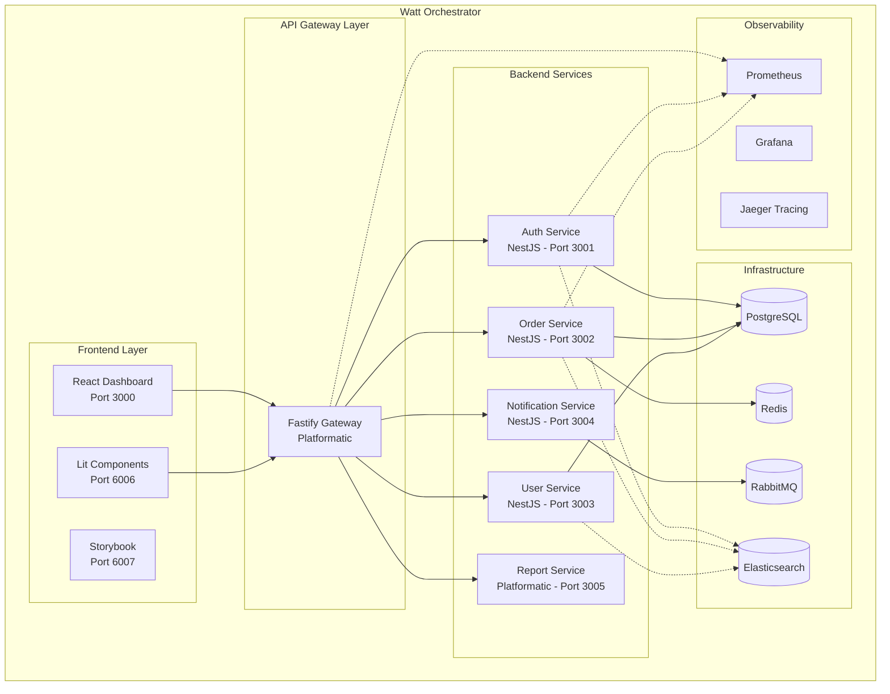

# MULTI-STACK INFRASTRUCTURE - Lit + NestJS + Platformatic Gateway

## 🎯 OVERVIEW

**Obiettivo**: Infrastruttura multi-stack orchestrata con **Watt** che supporta:
- ✅ **Fastify Gateway** (Platformatic) - Proxy/Load Balancer  
- ✅ **NestJS Microservices** - Business Logic Services
- ✅ **Lit Elements** - Frontend Components Library
- ✅ **React Dashboard** - Admin Interface
- ✅ **Unified Logging** - Structured logs cross-stack
- ✅ **Monitoring Stack** - Metrics, Traces, Health checks

**Pattern**: **Backend for Frontend (BFF) + Service Mesh**

---

## 🏗️ ARCHITETTURA MULTI-STACK

### Service Mesh Architecture


### Stack Decision Matrix

| Component | Technology | Rationale | Port |
|-----------|------------|-----------|------|
| **API Gateway** | Fastify (Platformatic) | Proxy, rate limiting, auth middleware | 3000 |
| **Auth Service** | NestJS | Complex business logic, JWT, decorators | 3001 |
| **Order Service** | NestJS | Workflow engine, state machines | 3002 |
| **User Service** | NestJS | RBAC, organization hierarchy | 3003 |
| **Notification Service** | NestJS | Email, WebSocket, Push notifications | 3004 |
| **Report Service** | Platformatic | CRUD-heavy, auto-generated APIs | 3005 |
| **Frontend Dashboard** | React + Vite | Admin interface, complex state | 5173 |
| **Components Library** | Lit Elements | Reusable web components | 6006 |

---

## 📁 DIRECTORY STRUCTURE

```
order-manager/
├── watt.json                          # 🎯 Watt orchestration
├── package.json                       # Root dependencies
├── docker-compose.infra.yml           # Infrastructure only
├── .env                               # Global environment
├── gateway/                           # 🚪 API Gateway (Platformatic)
│   ├── platformatic.json
│   ├── routes/
│   │   ├── proxy.js                   # Service routing
│   │   ├── auth.js                    # Auth middleware
│   │   └── health.js                  # Health aggregation
│   ├── plugins/
│   │   ├── rate-limiting.js
│   │   ├── cors.js
│   │   └── logging.js
│   └── schemas/
├── services/                          # 🔧 Microservices
│   ├── auth-service/                  # NestJS
│   │   ├── package.json
│   │   ├── nest-cli.json
│   │   ├── src/
│   │   │   ├── main.ts
│   │   │   ├── auth/
│   │   │   ├── jwt/
│   │   │   └── users/
│   │   ├── test/
│   │   └── Dockerfile
│   ├── order-service/                 # NestJS
│   │   ├── package.json
│   │   ├── src/
│   │   │   ├── main.ts
│   │   │   ├── orders/
│   │   │   ├── workflow/
│   │   │   └── approvals/
│   │   └── test/
│   ├── user-service/                  # NestJS
│   │   ├── package.json
│   │   ├── src/
│   │   │   ├── main.ts
│   │   │   ├── users/
│   │   │   ├── organizations/
│   │   │   └── rbac/
│   │   └── test/
│   ├── notification-service/          # NestJS
│   │   ├── package.json
│   │   ├── src/
│   │   │   ├── main.ts
│   │   │   ├── email/
│   │   │   ├── websocket/
│   │   │   └── push/
│   │   └── test/
│   └── report-service/                # Platformatic (CRUD-heavy)
│       ├── platformatic.json
│       ├── schema.sql
│       ├── routes/
│       └── plugins/
├── frontend/                          # 🎨 Frontend Applications
│   ├── dashboard/                     # React Admin
│   │   ├── package.json
│   │   ├── vite.config.ts
│   │   ├── src/
│   │   │   ├── services/              # API clients
│   │   │   ├── components/
│   │   │   ├── pages/
│   │   │   └── hooks/
│   │   └── public/
│   ├── components/                    # Lit Elements Library
│   │   ├── package.json
│   │   ├── rollup.config.js
│   │   ├── src/
│   │   │   ├── login-component/
│   │   │   ├── order-component/
│   │   │   ├── user-component/
│   │   │   └── shared/
│   │   ├── storybook/
│   │   │   ├── .storybook/
│   │   │   └── stories/
│   │   └── dist/                      # Built components
│   └── mobile/                        # React Native (future)
├── shared/                            # 📦 Shared Libraries
│   ├── types/                         # Common TypeScript types
│   │   ├── auth.types.ts
│   │   ├── order.types.ts
│   │   └── api.types.ts
│   ├── utils/
│   │   ├── logger.ts                  # Unified logging
│   │   ├── metrics.ts                 # Metrics collection
│   │   └── tracing.ts                 # Distributed tracing
│   ├── config/
│   │   ├── database.ts
│   │   ├── redis.ts
│   │   └── monitoring.ts
│   └── middleware/                    # Shared middleware
│       ├── auth.middleware.ts
│       ├── logging.middleware.ts
│       └── metrics.middleware.ts
├── infrastructure/                    # 🏗️ Infrastructure as Code
│   ├── monitoring/
│   │   ├── prometheus/
│   │   │   ├── prometheus.yml
│   │   │   └── rules/
│   │   ├── grafana/
│   │   │   ├── dashboards/
│   │   │   └── datasources/
│   │   ├── jaeger/
│   │   │   └── jaeger.yml
│   │   └── elasticsearch/
│   │       ├── elasticsearch.yml
│   │       └── kibana.yml
│   ├── docker/
│   │   ├── gateway.Dockerfile
│   │   ├── nestjs.Dockerfile
│   │   └── frontend.Dockerfile
│   └── k8s/                          # Kubernetes manifests
│       ├── gateway/
│       ├── services/
│       └── monitoring/
├── scripts/                           # 🔧 Development Scripts
│   ├── setup.sh                      # Initial setup
│   ├── dev.sh                        # Development mode
│   ├── build.sh                      # Build all
│   ├── test.sh                       # Test all
│   └── deploy.sh                     # Deploy
└── docs/                             # 📚 Documentation
    ├── INFRASTRUCTURE.md
    ├── MULTI_STACK.md
    └── MONITORING.md
```

---

## ⚙️ WATT CONFIGURATION

### Root watt.json (Multi-Stack Orchestrator)
```json
{
  "name": "order-manager",
  "entrypoint": "gateway",
  "services": [
    {
      "id": "gateway",
      "name": "api-gateway",
      "path": "./gateway",
      "type": "platformatic",
      "port": 3000,
      "dependencies": [
        "auth-service",
        "order-service", 
        "user-service",
        "notification-service",
        "report-service"
      ]
    },
    {
      "id": "auth-service",
      "name": "auth-service",
      "path": "./services/auth-service",
      "type": "node",
      "port": 3001,
      "command": "npm run start:dev",
      "env": {
        "NODE_ENV": "development",
        "DATABASE_URL": "{DATABASE_URL}",
        "REDIS_URL": "{REDIS_URL}",
        "JWT_SECRET": "{JWT_SECRET}"
      }
    },
    {
      "id": "order-service", 
      "name": "order-service",
      "path": "./services/order-service",
      "type": "node",
      "port": 3002,
      "command": "npm run start:dev",
      "dependencies": ["auth-service"],
      "env": {
        "NODE_ENV": "development",
        "DATABASE_URL": "{DATABASE_URL}",
        "REDIS_URL": "{REDIS_URL}",
        "AUTH_SERVICE_URL": "http://localhost:3001"
      }
    },
    {
      "id": "user-service",
      "name": "user-service", 
      "path": "./services/user-service",
      "type": "node",
      "port": 3003,
      "command": "npm run start:dev",
      "dependencies": ["auth-service"],
      "env": {
        "NODE_ENV": "development",
        "DATABASE_URL": "{DATABASE_URL}",
        "AUTH_SERVICE_URL": "http://localhost:3001"
      }
    },
    {
      "id": "notification-service",
      "name": "notification-service",
      "path": "./services/notification-service", 
      "type": "node",
      "port": 3004,
      "command": "npm run start:dev",
      "dependencies": ["auth-service"],
      "env": {
        "NODE_ENV": "development",
        "RABBITMQ_URL": "{RABBITMQ_URL}",
        "EMAIL_HOST": "{EMAIL_HOST}"
      }
    },
    {
      "id": "report-service",
      "name": "report-service",
      "path": "./services/report-service",
      "type": "platformatic",
      "port": 3005,
      "dependencies": ["auth-service"]
    }
  ],
  "web": [
    {
      "id": "dashboard",
      "name": "dashboard",
      "path": "./frontend/dashboard",
      "type": "vite",
      "port": 5173,
      "command": "npm run dev",
      "env": {
        "VITE_API_URL": "http://localhost:3000"
      }
    },
    {
      "id": "components",
      "name": "components-storybook",
      "path": "./frontend/components",
      "type": "storybook", 
      "port": 6006,
      "command": "npm run storybook"
    }
  ],
  "watch": {
    "enabled": true,
    "paths": [
      "./gateway",
      "./services",
      "./frontend",
      "./shared"
    ]
  },
  "telemetry": {
    "enabled": true,
    "exporters": {
      "prometheus": {
        "endpoint": "http://localhost:9090"
      },
      "jaeger": {
        "endpoint": "http://localhost:14268"
      },
      "elasticsearch": {
        "endpoint": "http://localhost:9200"
      }
    }
  },
  "healthChecks": {
    "enabled": true,
    "interval": "30s",
    "timeout": "5s"
  },
  "loadBalancing": {
    "strategy": "round-robin",
    "healthCheck": true
  }
}
```

---

## 🚪 FASTIFY GATEWAY CONFIGURATION

### Gateway Platformatic Config (gateway/platformatic.json)
```json
{
  "name": "api-gateway",
  "entrypoint": "app.js",
  "server": {
    "hostname": "0.0.0.0",
    "port": "{PORT}",
    "cors": {
      "origin": true,
      "credentials": true
    }
  },
  "plugins": {
    "paths": ["./plugins"]
  },
  "watch": {
    "enabled": true
  },
  "metrics": {
    "enabled": true,
    "endpoint": "/metrics"
  },
  "swagger": {
    "enabled": true,
    "path": "/documentation"
  },
  "rateLimit": {
    "max": 1000,
    "timeWindow": "1 minute"
  }
}
```

### Gateway Proxy Routes (gateway/routes/proxy.js)
```javascript
'use strict'

/** @param {import('fastify').FastifyInstance} fastify */
module.exports = async function (fastify, opts) {
  
  // Service registry - auto-populated by Watt
  const services = {
    auth: process.env.AUTH_SERVICE_URL || 'http://localhost:3001',
    order: process.env.ORDER_SERVICE_URL || 'http://localhost:3002', 
    user: process.env.USER_SERVICE_URL || 'http://localhost:3003',
    notification: process.env.NOTIFICATION_SERVICE_URL || 'http://localhost:3004',
    report: process.env.REPORT_SERVICE_URL || 'http://localhost:3005'
  }
  
  // Register HTTP proxy for each service
  for (const [serviceName, serviceUrl] of Object.entries(services)) {
    await fastify.register(require('@fastify/http-proxy'), {
      upstream: serviceUrl,
      prefix: `/api/${serviceName}`,
      rewritePrefix: `/api/${serviceName}`,
      // Forward original request info
      replyOptions: {
        rewriteRequestHeaders: (originalReq, headers) => {
          return {
            ...headers,
            'x-forwarded-for': originalReq.ip,
            'x-forwarded-proto': originalReq.protocol,
            'x-forwarded-host': originalReq.hostname,
            'x-service-name': serviceName
          }
        }
      },
      // Health check for upstream
      upstream: serviceUrl,
      websocket: serviceName === 'notification' // Enable WebSocket for notifications
    })
  }
  
  // Root health check - aggregates all services
  fastify.get('/health', async (request, reply) => {
    const healthChecks = []
    
    for (const [serviceName, serviceUrl] of Object.entries(services)) {
      try {
        const response = await fetch(`${serviceUrl}/health`, {
          timeout: 2000
        })
        healthChecks.push({
          service: serviceName,
          status: response.ok ? 'healthy' : 'unhealthy',
          url: serviceUrl,
          responseTime: response.headers.get('x-response-time')
        })
      } catch (error) {
        healthChecks.push({
          service: serviceName,
          status: 'down',
          url: serviceUrl,
          error: error.message
        })
      }
    }
    
    const overallHealthy = healthChecks.every(check => check.status === 'healthy')
    
    return {
      status: overallHealthy ? 'healthy' : 'degraded',
      timestamp: new Date().toISOString(),
      services: healthChecks,
      version: process.env.npm_package_version
    }
  })
  
  // Service discovery endpoint
  fastify.get('/services', async (request, reply) => {
    return {
      services: Object.entries(services).map(([name, url]) => ({
        name,
        url,
        prefix: `/api/${name}`
      }))
    }
  })
}
```

### Gateway Auth Middleware (gateway/plugins/auth.js)
```javascript
'use strict'

/** @param {import('fastify').FastifyInstance} fastify */
module.exports = async function (fastify, opts) {
  
  // JWT verification
  await fastify.register(require('@fastify/jwt'), {
    secret: process.env.JWT_SECRET || 'your-secret-key'
  })
  
  // Auth hook for protected routes
  fastify.addHook('onRequest', async (request, reply) => {
    const publicPaths = [
      '/health',
      '/services', 
      '/documentation',
      '/metrics',
      '/api/auth/login',
      '/api/auth/register',
      '/api/auth/refresh'
    ]
    
    // Skip auth for public paths
    if (publicPaths.some(path => request.url.startsWith(path))) {
      return
    }
    
    try {
      // Verify JWT token
      const token = request.headers.authorization?.replace('Bearer ', '')
      if (!token) {
        return reply.code(401).send({ error: 'Missing authorization token' })
      }
      
      const decoded = fastify.jwt.verify(token)
      
      // Add user info to headers for downstream services
      request.headers['x-user-id'] = decoded.sub
      request.headers['x-user-email'] = decoded.email
      request.headers['x-user-role'] = decoded.role
      request.headers['x-company-id'] = decoded.companyId
      
      // Log authentication for audit
      fastify.log.info({
        userId: decoded.sub,
        email: decoded.email,
        role: decoded.role,
        path: request.url,
        method: request.method
      }, 'Authenticated request')
      
    } catch (error) {
      fastify.log.warn({ error: error.message }, 'Authentication failed')
      return reply.code(401).send({ error: 'Invalid token' })
    }
  })
  
  // Rate limiting per user
  await fastify.register(require('@fastify/rate-limit'), {
    max: 100,
    timeWindow: '1 minute',
    keyGenerator: (request) => {
      return request.headers['x-user-id'] || request.ip
    }
  })
}
```

---

## 🔧 NESTJS SERVICES CONFIGURATION

### Auth Service Setup (services/auth-service/src/main.ts)
```typescript
import { NestFactory } from '@nestjs/core';
import { Logger, ValidationPipe } from '@nestjs/common';
import { ConfigService } from '@nestjs/config';
import { DocumentBuilder, SwaggerModule } from '@nestjs/swagger';
import { AuthModule } from './auth.module';
import { LoggingInterceptor } from '../shared/interceptors/logging.interceptor';
import { MetricsInterceptor } from '../shared/interceptors/metrics.interceptor';

async function bootstrap() {
  const app = await NestFactory.create(AuthModule);
  const configService = app.get(ConfigService);
  const logger = new Logger('AuthService');
  
  // Global configuration
  app.useGlobalPipes(new ValidationPipe({
    whitelist: true,
    forbidNonWhitelisted: true,
    transform: true
  }));
  
  // Observability interceptors
  app.useGlobalInterceptors(
    new LoggingInterceptor(),
    new MetricsInterceptor()
  );
  
  // CORS for development
  app.enableCors({
    origin: process.env.CORS_ORIGIN?.split(',') || '*',
    credentials: true
  });
  
  // Swagger documentation
  const config = new DocumentBuilder()
    .setTitle('Auth Service API')
    .setDescription('Authentication and authorization service for ORDER MANAGER')
    .setVersion('1.0')
    .addBearerAuth()
    .addTag('auth', 'Authentication endpoints')
    .addTag('users', 'User management endpoints')
    .build();
    
  const document = SwaggerModule.createDocument(app, config);
  SwaggerModule.setup('/api/docs', app, document);
  
  // Health check endpoint
  app.use('/health', (req, res) => {
    res.json({
      status: 'healthy',
      service: 'auth-service',
      timestamp: new Date().toISOString(),
      uptime: process.uptime(),
      version: process.env.npm_package_version
    });
  });
  
  // Metrics endpoint (Prometheus format)
  app.use('/metrics', async (req, res) => {
    const register = app.get('METRICS_REGISTRY');
    res.set('Content-Type', register.contentType);
    res.end(await register.metrics());
  });
  
  const port = configService.get<number>('PORT', 3001);
  await app.listen(port, '0.0.0.0');
  
  logger.log(`🚀 Auth Service running on port ${port}`);
  logger.log(`📚 Swagger docs available at http://localhost:${port}/api/docs`);
  logger.log(`📊 Metrics available at http://localhost:${port}/metrics`);
  logger.log(`💚 Health check at http://localhost:${port}/health`);
}

bootstrap();
```

### Shared Middleware for All NestJS Services (shared/middleware/logging.middleware.ts)
```typescript
import { Injectable, NestInterceptor, ExecutionContext, CallHandler, Logger } from '@nestjs/common';
import { Observable } from 'rxjs';
import { tap } from 'rxjs/operators';

@Injectable()
export class LoggingInterceptor implements NestInterceptor {
  private readonly logger = new Logger('HTTP');

  intercept(context: ExecutionContext, next: CallHandler): Observable<any> {
    const request = context.switchToHttp().getRequest();
    const response = context.switchToHttp().getResponse();
    const startTime = Date.now();
    
    const { method, url, body, headers } = request;
    const userAgent = headers['user-agent'] || '';
    const userEmail = headers['x-user-email'] || 'anonymous';
    const userId = headers['x-user-id'] || 'unknown';
    
    // Log incoming request
    this.logger.log({
      type: 'request',
      method,
      url,
      userAgent,
      userId,
      userEmail,
      body: this.sanitizeBody(body),
      timestamp: new Date().toISOString()
    });

    return next.handle().pipe(
      tap({
        next: (data) => {
          const duration = Date.now() - startTime;
          const { statusCode } = response;
          
          // Log successful response
          this.logger.log({
            type: 'response',
            method,
            url,
            statusCode,
            duration,
            userId,
            userEmail,
            responseSize: JSON.stringify(data).length,
            timestamp: new Date().toISOString()
          });
        },
        error: (error) => {
          const duration = Date.now() - startTime;
          const statusCode = error.status || 500;
          
          // Log error response
          this.logger.error({
            type: 'error',
            method,
            url,
            statusCode,
            duration,
            userId,
            userEmail,
            error: error.message,
            stack: error.stack,
            timestamp: new Date().toISOString()
          });
        }
      })
    );
  }
  
  private sanitizeBody(body: any): any {
    if (!body) return body;
    
    const sanitized = { ...body };
    // Remove sensitive fields
    delete sanitized.password;
    delete sanitized.confirmPassword;
    delete sanitized.token;
    delete sanitized.secret;
    
    return sanitized;
  }
}
```

---

## 🎨 LIT ELEMENTS CONFIGURATION

### Components Development Setup (frontend/components/package.json)
```json
{
  "name": "@order-manager/components",
  "version": "1.0.0",
  "type": "module",
  "main": "dist/index.js",
  "module": "dist/index.js",
  "types": "dist/index.d.ts",
  "exports": {
    ".": "./dist/index.js",
    "./login": "./dist/login-component.js",
    "./order": "./dist/order-component.js",
    "./user": "./dist/user-component.js"
  },
  "scripts": {
    "dev": "rollup -c -w",
    "build": "rollup -c && tsc --emitDeclarationOnly",
    "storybook": "storybook dev -p 6006",
    "build-storybook": "storybook build",
    "test": "jest",
    "test:watch": "jest --watch",
    "lint": "eslint src/**/*.ts",
    "typecheck": "tsc --noEmit"
  },
  "dependencies": {
    "lit": "^3.1.0",
    "@order-manager/shared-types": "workspace:*"
  },
  "devDependencies": {
    "@rollup/plugin-typescript": "^11.0.0",
    "@storybook/web-components-vite": "^7.6.0",
    "rollup": "^4.9.0",
    "typescript": "^5.3.0"
  }
}
```

### Lit Component with Gateway Integration (frontend/components/src/login-component/login-component.ts)
```typescript
import { LitElement, html, css } from 'lit';
import { customElement, property, state } from 'lit/decorators.js';
import { LoginRequest, LoginResponse } from '@order-manager/shared-types';

@customElement('order-login')
export class LoginComponent extends LitElement {
  
  // Configuration properties
  @property({ type: String, attribute: 'api-url' })
  apiUrl = 'http://localhost:3000/api'; // Gateway URL
  
  @property({ type: Boolean, attribute: 'remember-me-default' })
  rememberMeDefault = false;
  
  @property({ type: String, attribute: 'redirect-url' })
  redirectUrl = '/dashboard';
  
  // Internal state
  @state() private isLoading = false;
  @state() private email = '';
  @state() private password = '';
  @state() private rememberMe = this.rememberMeDefault;
  @state() private errors: Record<string, string> = {};
  @state() private loginError: string | null = null;
  
  static styles = css`
    :host {
      display: block;
      max-width: 400px;
      margin: 0 auto;
      padding: 2rem;
      font-family: var(--font-family, -apple-system, BlinkMacSystemFont, 'Segoe UI', Roboto);
      
      /* Debug borders */
      --debug-border: var(--login-debug-border, none);
    }
    
    .login-form {
      border: var(--debug-border);
      display: flex;
      flex-direction: column;
      gap: 1rem;
    }
    
    .field-group {
      border: var(--debug-border);
      display: flex;
      flex-direction: column;
      gap: 0.5rem;
    }
    
    label {
      font-weight: 500;
      color: var(--label-color, #374151);
    }
    
    input {
      padding: 0.75rem;
      border: 1px solid var(--border-color, #d1d5db);
      border-radius: 0.375rem;
      font-size: 1rem;
      transition: border-color 0.2s;
    }
    
    input:focus {
      outline: none;
      border-color: var(--primary-color, #3b82f6);
      box-shadow: 0 0 0 3px rgba(59, 130, 246, 0.1);
    }
    
    input.error {
      border-color: var(--error-color, #ef4444);
    }
    
    .error-message {
      color: var(--error-color, #ef4444);
      font-size: 0.875rem;
    }
    
    .checkbox-group {
      display: flex;
      align-items: center;
      gap: 0.5rem;
    }
    
    .submit-button {
      padding: 0.75rem 1.5rem;
      background: var(--primary-color, #3b82f6);
      color: white;
      border: none;
      border-radius: 0.375rem;
      font-size: 1rem;
      font-weight: 500;
      cursor: pointer;
      transition: background-color 0.2s;
    }
    
    .submit-button:hover:not(:disabled) {
      background: var(--primary-color-hover, #2563eb);
    }
    
    .submit-button:disabled {
      background: var(--disabled-color, #9ca3af);
      cursor: not-allowed;
    }
    
    .loading-spinner {
      display: inline-block;
      width: 1rem;
      height: 1rem;
      border: 2px solid transparent;
      border-top: 2px solid currentColor;
      border-radius: 50%;
      animation: spin 1s linear infinite;
    }
    
    @keyframes spin {
      from { transform: rotate(0deg); }
      to { transform: rotate(360deg); }
    }
    
    .login-error {
      background: var(--error-bg, #fef2f2);
      border: 1px solid var(--error-color, #ef4444);
      color: var(--error-color, #ef4444);
      padding: 0.75rem;
      border-radius: 0.375rem;
      font-size: 0.875rem;
    }
  `;
  
  private async handleSubmit(e: Event) {
    e.preventDefault();
    
    if (!this.validateForm()) {
      return;
    }
    
    this.isLoading = true;
    this.loginError = null;
    
    try {
      const loginRequest: LoginRequest = {
        email: this.email,
        password: this.password,
        rememberMe: this.rememberMe
      };
      
      // Call Gateway API
      const response = await fetch(`${this.apiUrl}/auth/login`, {
        method: 'POST',
        headers: {
          'Content-Type': 'application/json'
        },
        body: JSON.stringify(loginRequest)
      });
      
      if (!response.ok) {
        const errorData = await response.json();
        throw new Error(errorData.error || 'Login failed');
      }
      
      const loginResponse: LoginResponse = await response.json();
      
      // Store tokens
      const storage = this.rememberMe ? localStorage : sessionStorage;
      storage.setItem('accessToken', loginResponse.accessToken);
      storage.setItem('refreshToken', loginResponse.refreshToken);
      
      // Emit success event
      this.dispatchEvent(new CustomEvent('login-success', {
        detail: {
          user: loginResponse.user,
          tokens: {
            accessToken: loginResponse.accessToken,
            refreshToken: loginResponse.refreshToken
          }
        },
        bubbles: true
      }));
      
      // Debug log
      console.log('🎉 Login successful:', {
        user: loginResponse.user,
        timestamp: new Date().toISOString()
      });
      
    } catch (error) {
      this.loginError = error instanceof Error ? error.message : 'Unknown error';
      this.password = ''; // Clear password on error
      
      this.dispatchEvent(new CustomEvent('login-error', {
        detail: { error: this.loginError },
        bubbles: true
      }));
      
      console.error('❌ Login failed:', error);
      
    } finally {
      this.isLoading = false;
    }
  }
  
  private validateForm(): boolean {
    this.errors = {};
    let isValid = true;
    
    // Email validation
    if (!this.email) {
      this.errors.email = 'Email is required';
      isValid = false;
    } else if (!this.isValidEmail(this.email)) {
      this.errors.email = 'Please enter a valid email';
      isValid = false;
    }
    
    // Password validation
    if (!this.password) {
      this.errors.password = 'Password is required';
      isValid = false;
    } else if (this.password.length < 8) {
      this.errors.password = 'Password must be at least 8 characters';
      isValid = false;
    }
    
    this.requestUpdate();
    return isValid;
  }
  
  private isValidEmail(email: string): boolean {
    const emailRegex = /^[^\s@]+@[^\s@]+\.[^\s@]+$/;
    return emailRegex.test(email);
  }
  
  private handleEmailInput(e: Event) {
    const target = e.target as HTMLInputElement;
    this.email = target.value;
    if (this.errors.email) {
      delete this.errors.email;
      this.requestUpdate();
    }
  }
  
  private handlePasswordInput(e: Event) {
    const target = e.target as HTMLInputElement;
    this.password = target.value;
    if (this.errors.password) {
      delete this.errors.password;
      this.requestUpdate();
    }
  }
  
  private handleRememberMeChange(e: Event) {
    const target = e.target as HTMLInputElement;
    this.rememberMe = target.checked;
  }
  
  render() {
    return html`
      <form class="login-form" @submit=${this.handleSubmit}>
        ${this.loginError ? html`
          <div class="login-error">
            ${this.loginError}
          </div>
        ` : ''}
        
        <div class="field-group">
          <label for="email">Email</label>
          <input
            id="email"
            type="email"
            .value=${this.email}
            @input=${this.handleEmailInput}
            ?disabled=${this.isLoading}
            class=${this.errors.email ? 'error' : ''}
            autocomplete="email"
            placeholder="Enter your email"
          />
          ${this.errors.email ? html`
            <div class="error-message">${this.errors.email}</div>
          ` : ''}
        </div>
        
        <div class="field-group">
          <label for="password">Password</label>
          <input
            id="password"
            type="password"
            .value=${this.password}
            @input=${this.handlePasswordInput}
            ?disabled=${this.isLoading}
            class=${this.errors.password ? 'error' : ''}
            autocomplete="current-password"
            placeholder="Enter your password"
          />
          ${this.errors.password ? html`
            <div class="error-message">${this.errors.password}</div>
          ` : ''}
        </div>
        
        <div class="checkbox-group">
          <input
            id="remember-me"
            type="checkbox"
            .checked=${this.rememberMe}
            @change=${this.handleRememberMeChange}
            ?disabled=${this.isLoading}
          />
          <label for="remember-me">Remember me</label>
        </div>
        
        <button
          type="submit"
          class="submit-button"
          ?disabled=${this.isLoading}
        >
          ${this.isLoading ? html`
            <span class="loading-spinner"></span>
            Logging in...
          ` : 'Login'}
        </button>
      </form>
    `;
  }
}

declare global {
  interface HTMLElementTagNameMap {
    'order-login': LoginComponent;
  }
}
```

---

## 📊 UNIFIED LOGGING & MONITORING

### Shared Logger Configuration (shared/utils/logger.ts)
```typescript
import { createLogger, format, transports } from 'winston';
import 'winston-elasticsearch';

interface LogContext {
  service: string;
  version?: string;
  userId?: string;
  requestId?: string;
  correlationId?: string;
}

export class UnifiedLogger {
  private logger;
  
  constructor(private context: LogContext) {
    const { combine, timestamp, errors, json, colorize, simple } = format;
    
    // Base format for all logs
    const baseFormat = combine(
      timestamp({ format: 'ISO' }),
      errors({ stack: true }),
      format((info) => {
        // Add context to every log
        return {
          ...info,
          service: this.context.service,
          version: this.context.version || process.env.npm_package_version,
          environment: process.env.NODE_ENV || 'development',
          hostname: process.env.HOSTNAME || 'localhost'
        };
      })()
    );
    
    // Development vs Production formats
    const isDev = process.env.NODE_ENV === 'development';
    
    this.logger = createLogger({
      level: process.env.LOG_LEVEL || (isDev ? 'debug' : 'info'),
      format: isDev 
        ? combine(baseFormat, colorize(), simple())
        : combine(baseFormat, json()),
      transports: [
        // Console output
        new transports.Console({
          handleExceptions: true,
          handleRejections: true
        }),
        
        // File output for non-dev environments
        ...(isDev ? [] : [
          new transports.File({
            filename: '/var/log/order-manager/error.log',
            level: 'error',
            maxsize: 10485760, // 10MB
            maxFiles: 5
          }),
          new transports.File({
            filename: '/var/log/order-manager/combined.log',
            maxsize: 10485760,
            maxFiles: 5
          })
        ]),
        
        // Elasticsearch for production
        ...(process.env.ELASTICSEARCH_URL ? [
          new transports.Elasticsearch({
            level: 'info',
            clientOpts: {
              node: process.env.ELASTICSEARCH_URL,
              auth: {
                username: process.env.ELASTICSEARCH_USER || 'elastic',
                password: process.env.ELASTICSEARCH_PASS || 'changeme'
              }
            },
            index: 'order-manager-logs',
            indexTemplate: {
              name: 'order-manager-logs-template',
              pattern: 'order-manager-logs-*',
              settings: {
                number_of_shards: 1,
                number_of_replicas: 0
              }
            }
          })
        ] : [])
      ]
    });
  }
  
  // Structured logging methods
  info(message: string, meta: object = {}) {
    this.logger.info(message, { ...meta, ...this.getContext() });
  }
  
  error(message: string, error?: Error, meta: object = {}) {
    this.logger.error(message, { 
      ...meta, 
      error: error ? {
        message: error.message,
        stack: error.stack,
        name: error.name
      } : undefined,
      ...this.getContext() 
    });
  }
  
  warn(message: string, meta: object = {}) {
    this.logger.warn(message, { ...meta, ...this.getContext() });
  }
  
  debug(message: string, meta: object = {}) {
    this.logger.debug(message, { ...meta, ...this.getContext() });
  }
  
  // HTTP request logging
  httpRequest(req: any, res: any, duration: number) {
    this.info('HTTP Request', {
      method: req.method,
      url: req.url,
      statusCode: res.statusCode,
      duration,
      userAgent: req.headers['user-agent'],
      ip: req.ip,
      userId: req.headers['x-user-id'],
      requestSize: req.headers['content-length'],
      responseSize: res.getHeader('content-length')
    });
  }
  
  // Business event logging
  businessEvent(event: string, data: object = {}) {
    this.info(`Business Event: ${event}`, {
      eventType: 'business',
      eventName: event,
      eventData: data,
      timestamp: new Date().toISOString()
    });
  }
  
  // Security event logging
  securityEvent(event: string, data: object = {}) {
    this.warn(`Security Event: ${event}`, {
      eventType: 'security',
      eventName: event,
      eventData: data,
      timestamp: new Date().toISOString()
    });
  }
  
  private getContext() {
    return {
      service: this.context.service,
      userId: this.context.userId,
      requestId: this.context.requestId,
      correlationId: this.context.correlationId
    };
  }
  
  // Update context (for request-scoped data)
  updateContext(updates: Partial<LogContext>) {
    this.context = { ...this.context, ...updates };
  }
}

// Factory function for each service
export function createServiceLogger(serviceName: string): UnifiedLogger {
  return new UnifiedLogger({
    service: serviceName,
    version: process.env.npm_package_version
  });
}

// Global logger instance
export const logger = createServiceLogger('gateway');
```

---

## 📈 PROMETHEUS METRICS SETUP

### Infrastructure Monitoring (infrastructure/monitoring/prometheus/prometheus.yml)
```yaml
global:
  scrape_interval: 15s
  evaluation_interval: 15s

rule_files:
  - "rules/*.yml"

scrape_configs:
  # Gateway metrics
  - job_name: 'api-gateway'
    static_configs:
      - targets: ['localhost:3000']
    metrics_path: '/metrics'
    scrape_interval: 5s
    
  # NestJS services
  - job_name: 'auth-service'
    static_configs:
      - targets: ['localhost:3001'] 
    metrics_path: '/metrics'
    scrape_interval: 10s
    
  - job_name: 'order-service'
    static_configs:
      - targets: ['localhost:3002']
    metrics_path: '/metrics'
    scrape_interval: 10s
    
  - job_name: 'user-service'
    static_configs:
      - targets: ['localhost:3003']
    metrics_path: '/metrics'
    scrape_interval: 10s
    
  - job_name: 'notification-service'
    static_configs:
      - targets: ['localhost:3004']
    metrics_path: '/metrics'
    scrape_interval: 10s
    
  - job_name: 'report-service'
    static_configs:
      - targets: ['localhost:3005']
    metrics_path: '/metrics'
    scrape_interval: 10s
    
  # Infrastructure monitoring
  - job_name: 'node-exporter'
    static_configs:
      - targets: ['localhost:9100']
      
  - job_name: 'postgres-exporter'
    static_configs:
      - targets: ['localhost:9187']
      
  - job_name: 'redis-exporter'
    static_configs:
      - targets: ['localhost:9121']

alerting:
  alertmanagers:
    - static_configs:
        - targets:
          - alertmanager:9093

# Remote write for long-term storage (optional)
remote_write:
  - url: "http://localhost:8086/api/v1/prom/write?db=prometheus"
    queue_config:
      max_samples_per_send: 1000
      capacity: 10000
```

---

## 🚀 INFRASTRUCTURE SETUP SCRIPTS

### Complete Infrastructure Setup (scripts/setup.sh)
```bash
#!/bin/bash

set -e

echo "🚀 Setting up ORDER MANAGER Multi-Stack Infrastructure..."

# Colors for output
RED='\033[0;31m'
GREEN='\033[0;32m'
YELLOW='\033[1;33m'
BLUE='\033[0;34m'
NC='\033[0m' # No Color

# Step 1: Check prerequisites
echo -e "${BLUE}📋 Checking prerequisites...${NC}"

if ! command -v node &> /dev/null; then
    echo -e "${RED}❌ Node.js is required but not installed${NC}"
    exit 1
fi

if ! command -v npm &> /dev/null; then
    echo -e "${RED}❌ npm is required but not installed${NC}"
    exit 1
fi

if ! command -v docker &> /dev/null; then
    echo -e "${RED}❌ Docker is required but not installed${NC}"
    exit 1
fi

echo -e "${GREEN}✅ Prerequisites check passed${NC}"

# Step 2: Install Watt CLI
echo -e "${BLUE}📦 Installing Platformatic Watt CLI...${NC}"
npm install -g @platformatic/cli

# Step 3: Install dependencies
echo -e "${BLUE}📦 Installing project dependencies...${NC}"
npm install

# Step 4: Setup environment variables
echo -e "${BLUE}⚙️  Setting up environment variables...${NC}"
if [ ! -f .env ]; then
    cp .env.example .env
    echo -e "${YELLOW}⚠️  Please update .env file with your configuration${NC}"
fi

# Step 5: Start infrastructure containers
echo -e "${BLUE}🐳 Starting infrastructure containers...${NC}"
docker-compose -f docker-compose.infra.yml up -d

# Wait for services to be ready
echo -e "${BLUE}⏳ Waiting for services to be ready...${NC}"
sleep 30

# Step 6: Setup databases
echo -e "${BLUE}🗄️  Setting up databases...${NC}"

# Wait for PostgreSQL
until docker exec $(docker-compose -f docker-compose.infra.yml ps -q postgres) pg_isready; do
  echo "Waiting for PostgreSQL..."
  sleep 2
done

# Create databases for each service
echo -e "${BLUE}📊 Creating service databases...${NC}"
docker exec $(docker-compose -f docker-compose.infra.yml ps -q postgres) createdb -U admin auth_service || true
docker exec $(docker-compose -f docker-compose.infra.yml ps -q postgres) createdb -U admin order_service || true
docker exec $(docker-compose -f docker-compose.infra.yml ps -q postgres) createdb -U admin user_service || true
docker exec $(docker-compose -f docker-compose.infra.yml ps -q postgres) createdb -U admin report_service || true

# Step 7: Install service dependencies
echo -e "${BLUE}📦 Installing service dependencies...${NC}"

# Gateway
cd gateway && npm install && cd ..

# NestJS Services
cd services/auth-service && npm install && cd ../..
cd services/order-service && npm install && cd ../..
cd services/user-service && npm install && cd ../..
cd services/notification-service && npm install && cd ../..

# Report service (Platformatic)
cd services/report-service && npm install && cd ../..

# Frontend
cd frontend/dashboard && npm install && cd ../..
cd frontend/components && npm install && cd ../..

# Step 8: Build shared packages
echo -e "${BLUE}🔧 Building shared packages...${NC}"
cd shared/types && npm run build && cd ../..
cd shared/utils && npm run build && cd ../..

# Step 9: Run database migrations
echo -e "${BLUE}🚀 Running database migrations...${NC}"
cd services/auth-service && npm run migration:run && cd ../..
cd services/order-service && npm run migration:run && cd ../..
cd services/user-service && npm run migration:run && cd ../..

# Step 10: Seed databases
echo -e "${BLUE}🌱 Seeding databases...${NC}"
cd services/auth-service && npm run seed && cd ../..
cd services/order-service && npm run seed && cd ../..
cd services/user-service && npm run seed && cd ../..

echo -e "${GREEN}🎉 Setup completed successfully!${NC}"
echo ""
echo -e "${BLUE}📍 Available Services:${NC}"
echo "  🚪 API Gateway:       http://localhost:3000"
echo "  🔐 Auth Service:      http://localhost:3001"
echo "  📋 Order Service:     http://localhost:3002" 
echo "  👥 User Service:      http://localhost:3003"
echo "  📧 Notification:      http://localhost:3004"
echo "  📊 Report Service:    http://localhost:3005"
echo "  🎨 Dashboard:         http://localhost:5173"
echo "  📚 Components:        http://localhost:6006"
echo ""
echo -e "${BLUE}📊 Monitoring:${NC}"
echo "  📈 Prometheus:        http://localhost:9090"
echo "  📊 Grafana:           http://localhost:3001"
echo "  🔍 Jaeger:            http://localhost:16686"
echo "  📋 Elasticsearch:     http://localhost:9200"
echo ""
echo -e "${YELLOW}🚀 To start development:${NC}"
echo "  watt start"
echo ""
echo -e "${YELLOW}🧪 To run tests:${NC}"
echo "  npm test"
echo ""
echo -e "${YELLOW}📚 To view documentation:${NC}"
echo "  http://localhost:3000/documentation"
```

### Development Start Script (scripts/dev.sh)
```bash
#!/bin/bash

set -e

echo "🚀 Starting ORDER MANAGER Development Environment..."

# Colors
GREEN='\033[0;32m'
BLUE='\033[0;34m'
YELLOW='\033[1;33m'
NC='\033[0m'

# Check if infrastructure is running
echo -e "${BLUE}🔍 Checking infrastructure...${NC}"
if ! docker-compose -f docker-compose.infra.yml ps | grep -q "Up"; then
    echo -e "${YELLOW}⚠️  Starting infrastructure containers...${NC}"
    docker-compose -f docker-compose.infra.yml up -d
    sleep 10
fi

# Start all services with Watt
echo -e "${BLUE}🎯 Starting all services with Watt...${NC}"
watt start

echo -e "${GREEN}✅ Development environment is ready!${NC}"
echo ""
echo -e "${BLUE}📍 Available URLs:${NC}"
echo "  🚪 API Gateway:       http://localhost:3000"
echo "  🎨 Dashboard:         http://localhost:5173"
echo "  📚 Components:        http://localhost:6006"
echo "  📊 Grafana:           http://localhost:3001"
echo "  📈 Prometheus:        http://localhost:9090"
echo ""
echo -e "${YELLOW}💡 Tips:${NC}"
echo "  • All services auto-reload on file changes"
echo "  • Check health: curl http://localhost:3000/health"
echo "  • View logs: watt logs"
echo "  • Stop all: watt stop"
```

---

## 🎯 STEP-BY-STEP IMPLEMENTATION

### Week 1: Infrastructure Foundation
```bash
# Day 1: Basic setup
npm install -g @platformatic/cli
mkdir order-manager && cd order-manager
watt create .

# Day 2: Gateway + Auth Service
mkdir gateway services/auth-service
# Implement Fastify gateway
# Implement NestJS auth service

# Day 3: Infrastructure + Monitoring  
docker-compose -f docker-compose.infra.yml up -d
# Setup Prometheus + Grafana
# Configure unified logging

# Day 4: Order Service + Integration
mkdir services/order-service
# Implement NestJS order service
# Test service-to-service communication

# Day 5: Frontend Setup
mkdir frontend/dashboard frontend/components
# Setup React dashboard
# Create first Lit component
```

### Immediate Next Steps

1. **Create directory structure**
2. **Configure Watt orchestration**
3. **Setup Fastify gateway**
4. **Implement first NestJS service (Auth)**
5. **Add monitoring infrastructure**

**Ready to start? Quale step vuoi che implementiamo per primo?** 🚀

L'approccio multi-stack con Watt ti dà la **flessibilità di sperimentare** con NestJS mantenendo i **vantaggi dell'orchestrazione automatica**!

---

**🎯 STATUS**: READY FOR IMPLEMENTATION  
**🚀 NEXT ACTION**: Iniziare con setup Watt + Gateway configuration

*Questo setup permette il meglio di tutti i mondi: NestJS per business logic complessa, Platformatic per CRUD rapidi, Lit per componenti riutilizzabili, tutto orchestrato da Watt con monitoring enterprise-level.*
