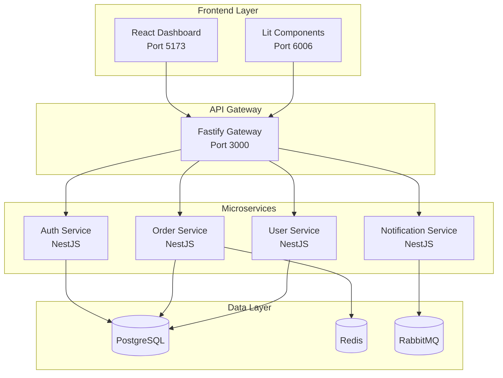
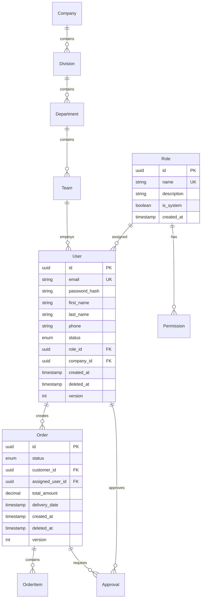
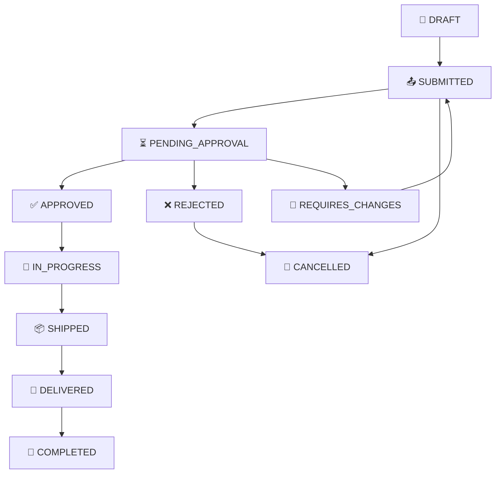

# 📦 ORDER MANAGER

[](https://nodejs.org/)
[](https://www.typescriptlang.org/)
[](https://www.fastify.io/)
[](LICENSE)

> **Multi-stack order management system** with **Domain-Driven Design (DDD)**, **Test-Driven Development (TDD)**, and **Extreme Programming (XP)** methodologies.

A modern, scalable order management platform supporting multi-level approval workflows, real-time notifications, and comprehensive RBAC authorization.

---

## 🚀 Quick Start

```bash
# Clone repository
git clone <repository-url>
cd order-manager

# Install dependencies
npm install
cd gateway && npm install && cd ..
cd shared/types && npm install && cd ../..

# Start development environment
npm run dev
```

**Access Points**:
- 🚪 **Gateway API**: http://localhost:3000
- 📚 **Components** (coming soon): http://localhost:6006
- 🔍 **Health Check**: http://localhost:3000/health

---

## 🏗️ Architecture Overview

### System Architecture



### Domain Model



---

## 🎯 Core Features

### ✅ Currently Implemented
- **🔐 Authentication**: JWT-based auth with refresh tokens
- **🚪 API Gateway**: Fastify-based routing and proxy
- **📝 TypeScript**: Full type safety across the stack
- **🧪 Development Setup**: Hot reload with tsx

### 🚧 In Development
- **👥 User Management**: Registration with approval workflow
- **📦 Order Management**: Multi-level approval system
- **🎨 UI Components**: Lit Elements component library
- **📊 Dashboard**: React-based admin interface

### 🗺️ Roadmap
- **🔔 Notifications**: Email, WebSocket, Push notifications
- **📅 Calendar Integration**: Google Calendar for deliveries
- **📈 Reports**: PDF/Excel generation with JSReport
- **🔒 RBAC**: Role-based access control system

---

## 🛠️ Tech Stack

| Layer | Technology | Purpose |
|-------|------------|---------|
| **Frontend** | Lit Elements + React | Reusable components + Dashboard |
| **API Gateway** | Fastify + TypeScript | Request routing and authentication |
| **Backend** | NestJS + TypeScript | Business logic microservices |
| **Database** | PostgreSQL | Primary data storage |
| **Cache** | Redis | Session and temporary data |
| **Queue** | RabbitMQ | Async messaging and events |
| **Development** | tsx + TypeScript | Direct TS execution |

---

## 📁 Project Structure

```
order-manager/
├── gateway/                    # 🚪 API Gateway (Fastify + TypeScript)
│   ├── app.ts                  # Main server entry
│   ├── package.json
│   └── tsconfig.json
├── frontend/
│   ├── components/             # 🎨 Lit Elements Library
│   └── dashboard/              # 🎨 React Admin Dashboard
├── services/                   # 🔧 NestJS Microservices
│   ├── auth-service/           # Authentication & JWT
│   ├── order-service/          # Order management & workflow
│   ├── user-service/           # User & organization management
│   └── notification-service/   # Email, WebSocket, Push
├── shared/
│   └── types/                  # 📦 Common TypeScript definitions
├── scripts/                    # 🔧 Development automation
│   ├── setup.sh
│   └── dev.sh
└── infrastructure/             # 🏗️ Docker, K8s, Terraform
```

---

## 🔄 Order Workflow

The system implements a sophisticated approval workflow based on order amounts:



### Approval Thresholds
- **< €1,000**: 🟢 Auto-approved
- **€1,000 - €4,999**: 🟡 1 signature (Manager)
- **€5,000 - €19,999**: 🟠 2 signatures (Manager + Director)
- **≥ €20,000**: 🔴 3 signatures (Manager + Director + Admin)

---

## 🧪 Development Workflow

This project follows **Test-Driven Development (TDD)** and **Extreme Programming (XP)** practices:

### TDD Cycle
1. **🔴 RED**: Write failing test first
2. **🟢 GREEN**: Write minimal code to pass
3. **🔵 REFACTOR**: Improve code quality

### Testing Strategy
- **70%** Unit Tests (Domain logic, Use cases)
- **20%** Integration Tests (Repositories, Controllers)  
- **10%** E2E Tests (Full user scenarios)

### BDD Scenarios
```gherkin
Feature: Order Approval
  Scenario: Manager approves small order
    Given an order with amount €800
    When the order is submitted
    Then it should be auto-approved
    And customer receives notification
```

---

## 🚀 Getting Started

### Prerequisites
- **Node.js**: ≥ 18.19.0
- **npm**: ≥ 9.0.0
- **Git**: Latest version

### Installation

1. **Clone the repository**
   ```bash
   git clone <repository-url>
   cd order-manager
   ```

2. **Install dependencies**
   ```bash
   npm install
   ```

3. **Setup workspaces**
   ```bash
   # Gateway
   cd gateway && npm install && cd ..
   
   # Shared types
   cd shared/types && npm install && npm run build && cd ../..
   ```

4. **Start development**
   ```bash
   npm run dev
   ```

### Environment Variables

Create a `.env` file:
```bash
NODE_ENV=development
GATEWAY_PORT=3000
CORS_ORIGIN=http://localhost:6006,http://localhost:5173
LOG_LEVEL=debug
```

---

## 🤝 Contributing

We welcome contributions! Here's how to get involved:

### 🐛 Reporting Issues

**Before creating an issue:**
1. Search existing issues to avoid duplicates
2. Use our issue templates
3. Provide minimal reproduction steps

**Issue Types:**
- 🐛 **Bug Report**: Something isn't working
- ✨ **Feature Request**: New functionality
- 📚 **Documentation**: Improve or fix docs
- 🔧 **Enhancement**: Improve existing features

### 🔀 Pull Requests

**Process:**
1. **Fork** the repository
2. **Create** a feature branch: `git checkout -b feature/amazing-feature`
3. **Follow** our coding conventions
4. **Write** tests for new functionality
5. **Ensure** all tests pass: `npm test`
6. **Commit** with conventional commits: `feat: add amazing feature`
7. **Push** to your fork: `git push origin feature/amazing-feature`
8. **Open** a Pull Request

**PR Guidelines:**
- ✅ One feature per PR
- ✅ Include tests
- ✅ Update documentation
- ✅ Follow TDD cycle
- ✅ Pass all CI checks

### 🏷️ Commit Convention

We use [Conventional Commits](https://conventionalcommits.org/):

```
type(scope): subject

feat(auth): add JWT refresh token endpoint
fix(orders): resolve optimistic locking issue
test(users): add BDD scenarios for registration
docs(readme): update setup instructions
```

**Types**: `feat`, `fix`, `docs`, `test`, `refactor`, `chore`

---

## 📋 Current Epics & Issues

### 🎯 Epic 1: Authentication System
- [ ] **#1** Setup JWT authentication service
- [ ] **#2** Implement refresh token mechanism  
- [ ] **#3** Add password reset functionality
- [ ] **#4** Create user registration with approval

### 🎯 Epic 2: Order Management Core
- [ ] **#5** Design order domain model
- [ ] **#6** Implement order creation workflow
- [ ] **#7** Add multi-level approval system
- [ ] **#8** Create order status tracking

### 🎯 Epic 3: Frontend Components
- [x] **#9** Setup Lit Elements infrastructure ✅
- [ ] **#10** Create login component with MSW mocks
- [ ] **#11** Build order form component
- [ ] **#12** Design approval workflow UI

### 🎯 Epic 4: API Gateway & Infrastructure  
- [x] **#13** Setup Fastify gateway with TypeScript ✅
- [x] **#14** Configure development environment ✅
- [ ] **#15** Add request/response logging
- [ ] **#16** Implement rate limiting

### 🎯 Epic 5: Testing & Quality
- [ ] **#17** Setup Jest testing framework
- [ ] **#18** Add BDD scenarios with Cucumber
- [ ] **#19** Implement code coverage reporting
- [ ] **#20** Setup CI/CD pipeline

---

## 📊 Development Commands

| Command | Purpose |
|---------|---------|
| `npm run dev` | Start development environment |
| `npm run build` | Build all workspaces |
| `npm test` | Run all tests |
| `npm run setup` | Initial project setup |

### Gateway Commands
```bash
cd gateway
npm run dev        # Start with hot reload
npm run start      # Production start
```

### Shared Types Commands
```bash
cd shared/types
npm run build      # Compile TypeScript
npm run dev        # Watch mode compilation
```

---

## 📄 License

This project is licensed under the **MIT License** - see the [LICENSE](LICENSE) file for details.

---

## 🙏 Acknowledgments

- **Domain-Driven Design** principles by Eric Evans
- **Clean Architecture** concepts by Robert C. Martin
- **Test-Driven Development** methodologies
- **Extreme Programming** practices

---

## 📞 Support

- 🐛 **Issues**: [GitHub Issues](../../issues)
- 💬 **Discussions**: [GitHub Discussions](../../discussions)
- 📧 **Email**: [Contact Us](mailto:support@order-manager.com)

---

**⭐ If you find this project useful, please give it a star on GitHub!**